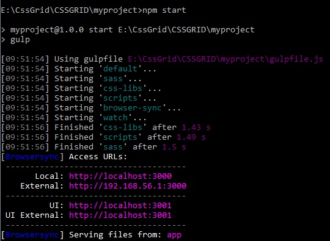

# SassGulpTest
## This is my first test work with CSSGrid and SASS module
> It makes no sense for you but
i have learned some new info for myself 

### To run the test, 
- open the command line in the file directory, 
- enter **"npm start"** and wait ... 
> a browser window will open with the result of the work I have done.

### code in cmd
```npm start```

### Result

